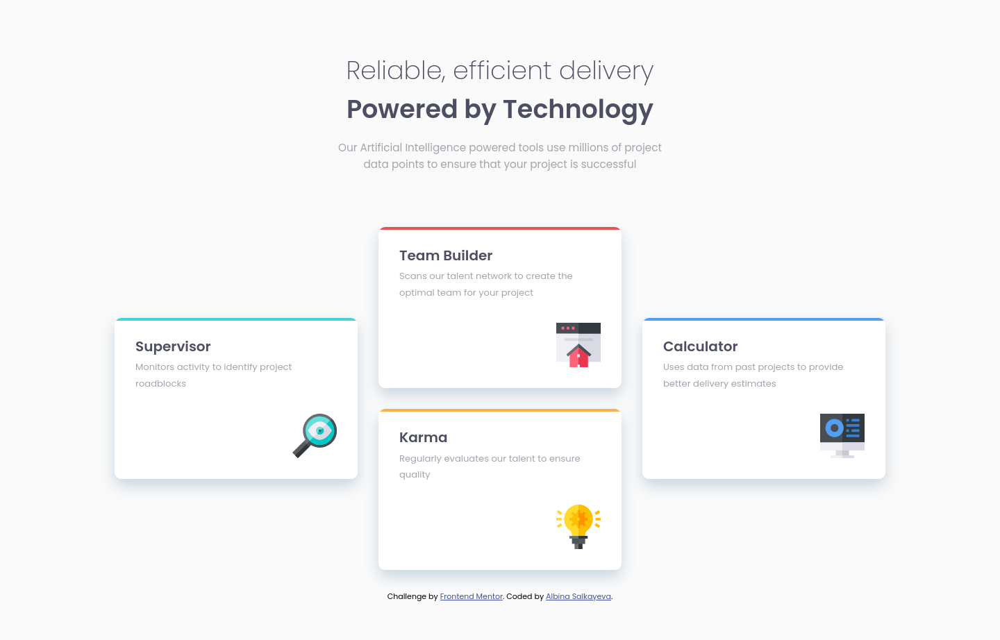
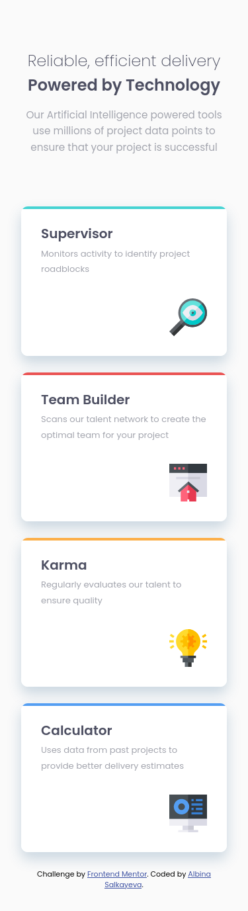

# Frontend Mentor - Four card feature section solution

This is a solution to the [Four card feature section challenge on Frontend Mentor](https://www.frontendmentor.io/challenges/four-card-feature-section-weK1eFYK). Frontend Mentor challenges help you improve your coding skills by building realistic projects. 

## Table of contents

- [Overview](#overview)
  - [The challenge](#the-challenge)
  - [Screenshot](#screenshot)
  - [Links](#links)
- [My process](#my-process)
  - [Built with](#built-with)
  - [What I learned](#what-i-learned)
  - [Useful resources](#useful-resources)
- [Author](#author)

## Overview

### The challenge

Users should be able to:

- View the optimal layout for the site depending on their device's screen size

### Screenshot

|Desktop|Mobile|
|:-:|:-:|
|||

### Links

- Solution URL: [https://github.com/albina0104/four-card-feature-section](https://github.com/albina0104/four-card-feature-section)
- Live Site URL: [https://albina0104.github.io/four-card-feature-section/](https://albina0104.github.io/four-card-feature-section/)

## My process

### Built with

- HTML5
- Sass
- Grid
- Mobile-first workflow

### What I learned

- I learned how to use pseudo elements `::before` and `::after` in CSS

- To use placeholder selectors in Sass

### Useful resources

- [CSS Pseudo-elements :: in 100 Seconds](https://www.example.com) - a super useful short video explanation

## Author

- Frontend Mentor - [@albina0104](https://www.frontendmentor.io/profile/albina0104)
- GitHub - [albina0104](https://github.com/albina0104)
